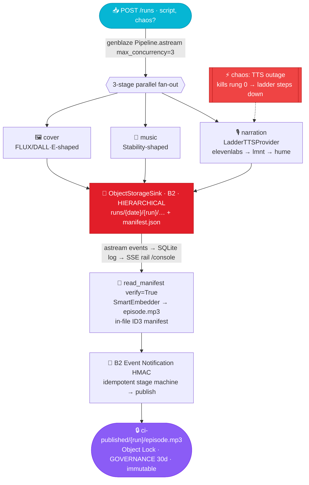

<div align="center">
  
  <h1>🎙️ CastIron</h1>
  <p><em>Script to published episode — even when your TTS provider dies</em></p>
  

  <br/>

  [](https://castiron.edycu.dev)
  [](https://castiron.edycu.dev/pitch.html)
  [](https://api.castiron.edycu.dev/docs)
  [](https://youtu.be/-l133pcaa24)
  [](https://devpost.com/software/castiron)
  [](https://backblaze-generative-media.devpost.com)

  <br/>

  
  
  
  
  [](tests)
  [](#-production-readiness)
  [](LICENSE)
  [](https://github.com/edycutjong/castiron/releases)
  [](https://github.com/edycutjong/castiron/actions/workflows/ci.yml)

</div>

> **Hero moment:** flip the *TTS outage* chaos toggle → the narration ladder catches the
> failure on rung 0 (ElevenLabs), steps to rung 1 (LMNT), and the episode still lands —
> the manifest recording the **actual** provider used, not the requested one.
> Proven: **96/96 episodes shipped verified across healthy + forced-outage runs, 0 dropped**
> ([`DEMO.md`](DEMO.md)).

---

## 🧩 The Problem & the Solution

**The problem.** Generative-media pipelines are brittle in exactly one place that matters:
the vendor call. TTS providers throttle, return 500s, and go down — and when they do, a
naive pipeline drops the *entire* episode: the narration, the music, the cover, the run.
For anything on a schedule (a daily brief, a podcast, an automated show), a single upstream
outage means dead air. On top of that, once an episode *is* produced, most pipelines can't
prove it wasn't silently altered afterward — there's no tamper-evidence from render to
storage.

**The solution.** CastIron treats provider failure as the **expected** case, not the
exception:

- **Cross-provider failover ladder** — every narration render tries distinct vendors in
  order (ElevenLabs → LMNT → Hume). When one goes dark mid-render, the ladder steps down a
  rung and the episode still ships — the manifest recording the *actual* provider used.
- **Provenance hashed into the file** — each asset's manifest is embedded inside the MP3;
  editing one byte flips `verify()` to False. Tamper-evidence travels with the episode.
- **Immutable publish** — finished episodes land in Backblaze B2 under a real Object Lock,
  so "published" means "provably unaltered."
- **Self-healing orchestration** — an AgentLoop quality gate, transient-resume (single
  charge), a budget guard, and an always-green offline fallback keep the run alive.

The result is one measurable promise — **zero dropped episodes** — proven at 96/96 across
healthy and forced-outage runs. It's the difference between a demo that works once and a
pipeline you'd put on a schedule.

## ⚙️ What it does



- **Cross-provider TTS ladder** (`castiron/ladder.py`) — tries distinct vendors in order,
  records the actual rung in the manifest. This is CastIron's own primitive; Genblaze's
  built-in `fallback_models` is in-provider only (that gap is filed as a dossier issue).
- **AgentLoop quality gate** (`castiron/gate.py`) — a composite evaluator (LUFS band +
  silence ratio + duration drift) iterates the narration until it passes.
- **Event-driven publish** (`castiron/webhooks.py`) — a B2 Event Notification receiver with
  HMAC verification drives an **idempotent** render→mix→verify→publish stage machine
  (converges under duplicate and reordered delivery).
- **Tamper-evident** — the provenance manifest is embedded *inside* the MP3; editing one
  byte flips `verify()` to False.
- **Immutable publish** — finished episodes land under a real B2 **Object Lock**.
- **Budget guard** — a run whose projected cost exceeds `MAX_RUN_COST_USD` hard-aborts
  *before* spending, with a typed `BUDGET_ABORT`.
- **Always-green OFFLINE mode** — mock providers + a local backend give a zero-network,
  zero-credential path that is both the dev path and the demo-day disaster fallback.

## 🚀 Quickstart

```bash
# Prereqs: Python 3.11+, uv, ffmpeg on PATH (brew install ffmpeg / apt-get install -y ffmpeg)
uv sync                                   # installs genblaze==0.4.1 + deps

# OFFLINE — no keys, no network, always green:
OFFLINE=1 .venv/bin/python scripts/verify_offline.py  # → "ALL GREEN — 0 dropped episodes"
OFFLINE=1 .venv/bin/python -m uvicorn app.main:app    # → open /console for the live rail
#   POST /runs  {"script": "...", "chaos": "tts"}        (flip chaos to watch the ladder step)

# LIVE — real B2 + real vendors (see .env.example, scripts/b2_setup.sh --plan):
cp .env.example .env                      # fill B2_KEY_ID/B2_APP_KEY + ≥1 TTS key
.venv/bin/python scripts/live_smoke.py    # auth + both buckets + round-trip
.venv/bin/python scripts/live_publish.py  # real episode → Object-Locked publish
```

> Run Python via `.venv/bin/python`, **not** `uv run`, in an offline shell — `uv run`
> re-syncs and can drop the pre-installed `genblaze` wheels when the network is absent.

## 📊 Reproduce the numbers

```bash
OFFLINE=1 .venv/bin/python bench.py
# → HEADLINE: 96/96 episodes shipped hash-verified … — 0 dropped.
#   failover p50≈120ms · p95≈134ms  (OFFLINE orchestration; vendor synth excluded)
```

One command, fixed seed (`SEED=42`), zero config, exits non-zero on any correctness
failure. Full methodology, per-scenario table, and honest limitations: **[`DEMO.md`](DEMO.md)**.

## 🏭 Production readiness

- **175 tests passing** (100% line coverage on `castiron/`), ruff-clean. Run: `OFFLINE=1 .venv/bin/python -m pytest`.
- Deterministic OFFLINE regression net (mock providers + `LocalDirBackend` + in-memory SQLite).
- CI on GitHub Actions (ffmpeg + ruff + pytest + offline smoke).
- Idempotent stage machine (safe under duplicate/reordered webhook delivery).
- Typed failure modes: `BUDGET_ABORT`, degraded-but-recorded runs, constant-time HMAC verify.
- Durable SSE rail: the SQLite event log is the source of truth (reconnect-safe), the hub is
  a low-latency nudge.
- LIVE evidence packs: [`docs/evidence/p2-killswitch/`](docs/evidence/p2-killswitch/),
  [`docs/evidence/p3-live/`](docs/evidence/p3-live/).

### Engineering harness

A **6-stage GitHub Actions pipeline** (`.github/workflows/ci.yml`) with concurrency
control, gating deploy on green: **Quality → Security → Build → E2E → Performance → Deploy**.

| Layer | Tool | Status |
|---|---|---|
| Code quality | Ruff (lint) · Python 3.11 + 3.12 matrix | ✅ |
| Unit testing | pytest — **175 tests**, 100% line coverage (`castiron/`) | ✅ |
| End-to-end | API smoke (uvicorn `/healthz`) + `verify_offline.py` 4-scenario proof + ASGI integration tests | ✅ |
| Security (SAST) | CodeQL (`python`) — `.github/workflows/codeql.yml` | ✅ |
| Security (SCA) | Dependabot (`pip` + `github-actions`) + `pip-audit` | ✅ |
| Secret scanning | TruffleHog (CI) + GitHub secret scanning | ✅ |
| Performance | `bench.py` p50/p95 gate (advisory) | ✅ |
| Build | `uv build` wheel + sdist verification | ✅ |
| Community profile | CoC · Contributing · Security policy · Issue/PR templates | ✅ 100% |

Local mirror of the harness: `make ci` (lint + test + offline), `make e2e`, `make bench`,
`make security-scan`.

> Honest scope: E2E here is API/ASGI + the deterministic offline end-to-end proof (this is a
> FastAPI backend, not a web UI — no Playwright/Lighthouse). The performance stage measures
> OFFLINE orchestration latency, not vendor synthesis (see [`DEMO.md`](DEMO.md)).

## 🔌 How it uses the sponsors (the SDK is the engine, not decoration)

**Genblaze** drives the whole pipeline — not a single decorative call:

| Surface | Where |
|---|---|
| `Pipeline.astream(max_concurrency=3)` / `arun` — parallel fan-out + typed event stream | `pipeline.py` |
| `ObjectStorageSink` (HIERARCHICAL) + `read_manifest(verify=True)` | `pipeline.py` |
| `SmartEmbedder` — in-file ID3 manifest embed | `media.py` |
| `Pipeline.resume_step` / `aresume_step` — transient resume, single charge | `resume.py` |
| AgentLoop `CallableEvaluator` + `ThresholdEvaluator` + `AgentContext` | `gate.py` |
| `ObjectLockConfig(mode=GOVERNANCE)` immutable publish | `publish.py` |
| `StorageBackend` subclassing + `ProviderComplianceTests` conformance kit | `backends.py`, tests |
| `RetryPolicy` per rung; `S3StorageBackend.for_backblaze` LIVE swap | `ladder.py`, `backends.py` |

**Backblaze B2** is the storage plane *and* the control plane: HIERARCHICAL object layout,
**Event Notifications** (HMAC-signed) that trigger the publish stage machine, and **Object
Lock** that makes the published episode provably immutable — verified live by reading back
`get_object_retention` (`docs/evidence/p3-live/`).

**Why ONLY B2 + Genblaze:** the resilience thesis needs both halves — Genblaze's provider
abstraction is what makes a *cross-provider* ladder and manifest-verified resume possible,
and B2 Object Lock is what turns "published" into "provably unaltered." Swap either out and
the differentiator collapses: without Genblaze there's no uniform provider/manifest layer to
fail over across; without B2 Object Lock the tamper-evidence stops at the file and never
reaches storage.

## ⚠️ Honest limitations

- The OFFLINE benchmark measures orchestration latency with mock providers — **not**
  real-vendor synthesis time (provider-bound, excluded). The headline is reliability, not speed.
- LIVE parity (real B2 + real vendors) is proven by separate scripts/evidence, not by the
  deterministic OFFLINE suite.
- The full live Event-Notification round-trip needs the receiver deployed at a public URL;
  the HMAC verify + stage machine are proven offline against synthetic deliveries.
- See [`DEVIATIONS.md`](DEVIATIONS.md) for spec-vs-reality deltas and
  [`docs/friction-log.md`](docs/friction-log.md) for SDK friction filed upstream.

## 🗂️ Repo map

```
app/         FastAPI surface (/runs, /runs/{id}/events SSE, /console, /webhooks/b2)
castiron/    engine: pipeline · ladder · gate · resume · webhooks · publish · backends · media · db
scripts/     verify_offline.py · live_smoke.py · live_publish.py · b2_setup.sh · sdk_introspect.py
seed/        operator-seeded demo dataset (episodes.json)
tests/       175 tests (100% line coverage on castiron/)
docs/        evidence packs · friction log · dossier issues · assets
```

## 🙏 Acknowledgments

Built for the **[Backblaze Generative Media Hackathon](https://backblaze-generative-media.devpost.com)** on **[Genblaze](https://pypi.org/project/genblaze/) + [Backblaze B2](https://www.backblaze.com/cloud-storage)**. Thanks to the sponsors — Backblaze for B2 (S3 storage, Event Notifications, Object Lock) and GMI Cloud for FLUX image inference:

<p align="center">
  <a href="https://www.backblaze.com/cloud-storage"></a>
  &nbsp;&nbsp;&nbsp;&nbsp;&nbsp;&nbsp;
  <a href="https://www.gmicloud.ai"></a>
</p>

## 📄 License

[MIT](LICENSE) © 2026 Edy Cu

---

<div align="center">
  <sub>Built by <a href="https://edycu.dev"><b>Edy Cu Tjong</b></a> · <a href="https://github.com/edycutjong">GitHub</a> · <a href="https://x.com/edycutjong">X</a> · <a href="mailto:edy.cu@live.com">Email</a></sub>
</div>
